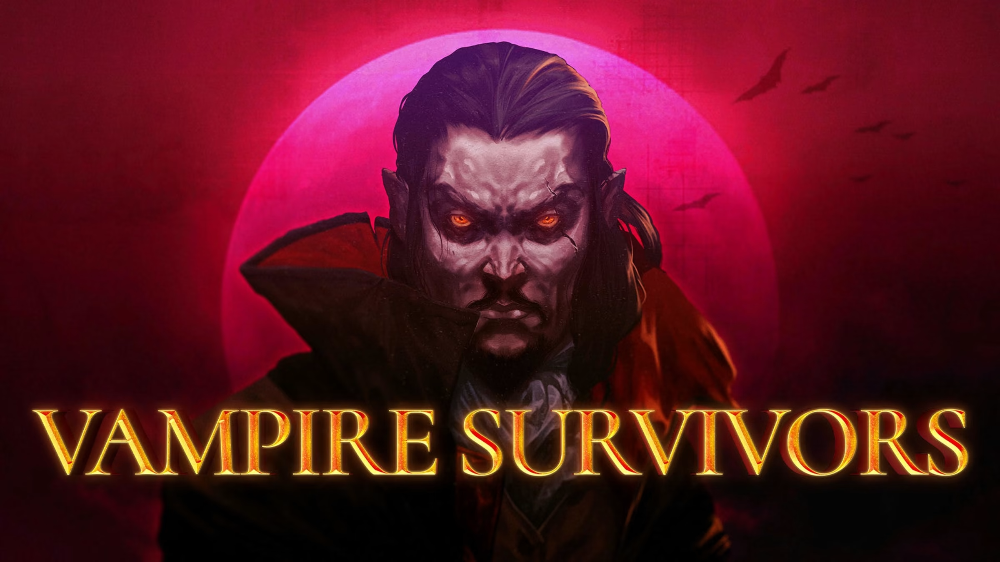
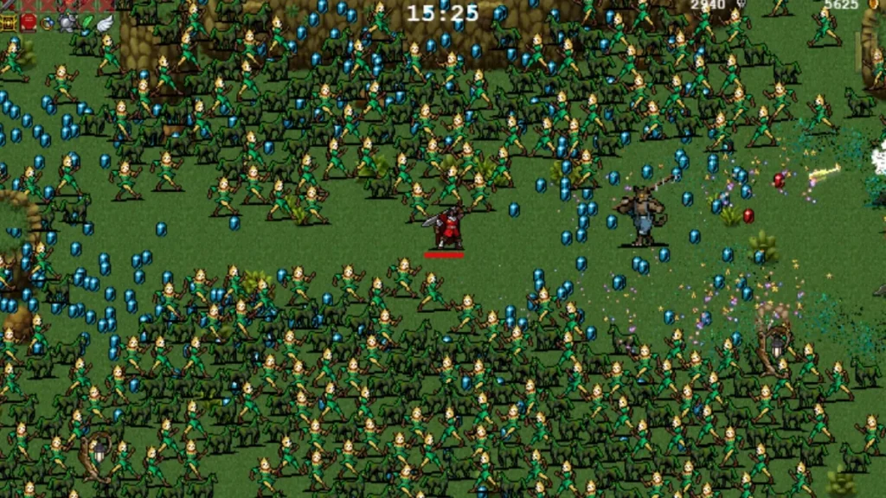
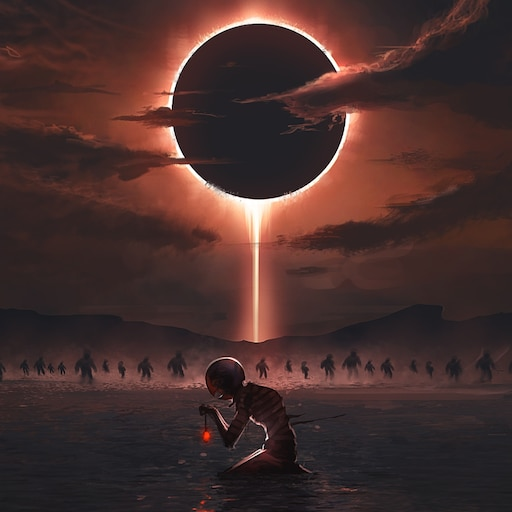

# Rythm Judgement

Rythm Judgement é um jogo de RPG, roguelike, bullet heaven, fortemente inspirado em Vampire Survivors. Ele traz elementos e mecânicas-chave de forma inovadora, utilizando a música como tema central.

## História

Magnus, um jovem com uma infância conturbada, cresceu isolado com apenas um violão e um sonho. Seu pai era alcoólatra e sua mãe abandonou a família. Aos 10 anos, o pai de Magnus morreu em um terrível acidente, deixando o violão como seu único amigo.

Após viver nas ruas por um ano, tocando em bares e esquinas por migalhas, um padre encontrou o jovem e o levou para um seminário. O seminário o acolheu e cuidou dele. Magnus nunca se separou de seu violão, e sua música foi amada pelos outros no convento, que apoiaram seu talento musical desde cedo. Ele cresceu tocando diversos instrumentos.

Aos 14 anos, Magnus se apaixonou pelo seminário e decidiu dedicar-se completamente, iniciando sua caminhada com Deus e a Santa Música. Ele cantou em várias igrejas e eventos, sendo reconhecido por toda a cidade. No entanto, sua vida tomou um rumo sombrio.

Quatro anos depois, aos 18, o mentor de Magnus, Morgan, sucumbiu à tentação de um demônio, sacrificando todos no seminário por poder e fama. Este evento abalou o mundo espiritual, liberando demônios da igreja. Morgan fugiu, e agora, com sua música, Magnus deve conter os demônios para impedir que se espalhem pelo mundo.

## Jogabilidade

Rythm Judgement é um jogo roguelike, visto de cima, com várias habilidades únicas. O jogo começa com o personagem principal, Magnus, e sua arma principal, um violão. Cada arma no jogo representa um instrumento, e cada instrumento adiciona algo à trilha sonora do jogo.

- No início do jogo, você tem um violão, então a trilha sonora é apenas de violão. À medida que você adquire outros instrumentos, eles são adicionados à trilha sonora e possuem ataques visíveis contra os inimigos.
- Cada fase contém uma música diferente.
- Cada música apresenta seu próprio conjunto de instrumentos.

## Referências

### Gameplay e Mecânicas
- Vampire Survivors

### História e Lore
- Berserk

