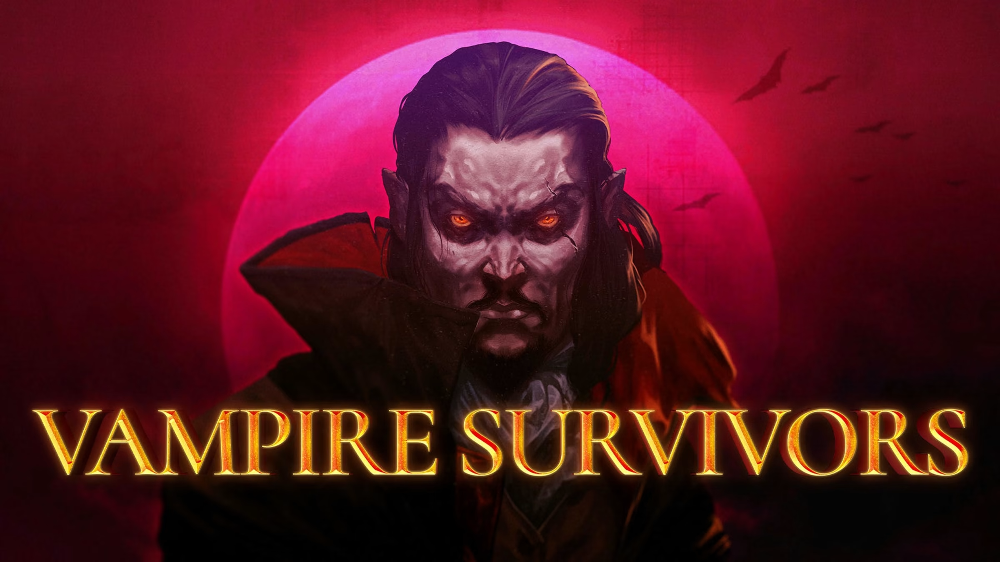

---

# Rythm Judgement  
**Design Document**  
_By Diogo Sabec, credits to Aizin for the Template_

---

# Table of Contents/Sumary (TBD)

## Introduction

### Game Summary Pitch  
*Rythm Judgement* is a bullet-heaven game inspired bly classics, where you use the rythm of the music to exterminate the demons on our world.

---

## Inspiration

  
| **<ins>Vampire Survivors</ins>** |  |
| --------- | ---- |
| lorem ipsum | 

| **<ins>Castlevania: Symphony of the Night</ins>** |  |
|---|---|
| lorem ipsum |  |

---

## Player Experience

In a single screen dungeon for each of the 15 levels, the player will solve a short but perhaps complex puzzle requiring planning and management. The player must learn and use their knowledge of the interactions between the player cells and various environmental items to understand how to pass through each level.

---

## Platform

The game is developed to be released on windows PC

---

## Development Software

- **Game Engine:** Godot 2.3 for the MVP version. Planning to move to unity.
- **Graphics & UI:** Aseprite  
- **Audio:** FL Studio 12

---

## Genre

- Singleplayer  
- Action  
- RPG

---

## Target Audience

Without heavy or complicated ideas, and intuitive-to-grasp mechanics, this game is marketed to at least casual game players who are up for puzzling challenges as well as more veteran players up for solving complicated problems

---

## Concept

### Gameplay Overview  
The player controls one character, its only contrtols are moving around. Attacks will be automatic, always  hitting in sync with the music. As the player starts it will only have one instrument, and the track of the music will be with only the selectetr instrument. As the player level up he will unlock more instruments, and they will be adding up in the music. 
As the player upgrades its insturments, the instrument will have a more important role on the song.

## Primary Weapons
Weapons/Instruments that the character will get when levelling up.
| Mechanic | Description | Image |
|---------|-------------|-------------|
| **Guitar** | Shoots a direct hit in a nearby enemy. | img.png |
| **Drums** | When activated, gives area damage around the player. | img.png |
| **Violin** | Shoots a continuous ray on a enemy. | img.png |
| **Piano** | Hits a random enemy that is  visible on the screen. Gives a small area damage | img.png |

---

## Items
Items that helps combo's.
| Mechanic | Description | Image |
|---------|-------------|-------------|
| **Sheet Music** | "Gives you a visual reference", increasing your critical hits %. | img.png |
| **Condoctor's Baton** | "Makes you more in sync with the music". Grants damage % increase. | img.png |

---

## Art

### Style  
lorem ipsum

### Design  
lorem ipsum
---

## Audio

### Music  
lorem ipsumn

### Sound Effects  
lorem ipsumn
---

## Game Experience

### UI  
lorem ipsumn
### Controls

## **Keyboard:**  
- Arrow Keys 
- WASD

**Gamepad:**  
- D-Pad
- Analogic stick

---

